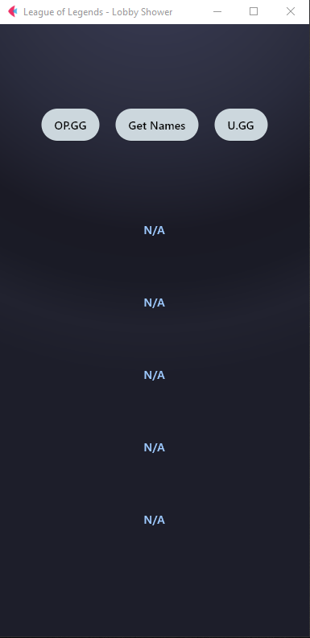

# GUI

# Overview

League of Legends made a change to hide usernames from champion select in Solo/Duo and Flex

Using /v5-chat API you can get the names from everyone
| __No dev-token needed!__

You can also multi-search OP.GG and U.GG from within app
# Getting Started

1. Download the release here : https://github.com/SecreSwalowtail/League-of-Legends-Lobby-Shower-GUI/releases
2. __Start League of Legends before starting this application__
3. Get into a lobby
4. Press Get Names

NOTE: Gets only the names from your team , not enemy team!
If the 1.2 release does not work for you try the 1.1

# Contact
Troubleshooting:
Discord : secre11

# DISCONTINUED
https://github.com/SecreSwalowtail/RankWatch
This one still works but does not support multiple clients.
